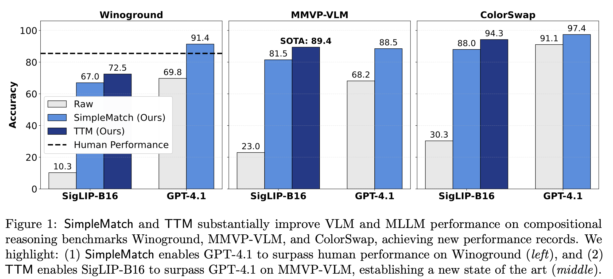

<h1 align="center">
  Test-Time Matching: Unlocking Compositional Reasoning in Multimodal Models
</h1>

<h3 align="center">
  <a href="https://yinglunz.com/blogs/ttm.html">Blog</a> ·
  <a href="https://arxiv.org/pdf/2510.07632">Paper</a>
</h3>

<p align="center">
  
</p>

## TL;DR
Modern multimodal models often appear to perform no better than random guessing on compositional reasoning tasks. We revisit this puzzle and find that part of the limitation arises from overly rigid evaluation metrics that systematically underestimate model capability. We introduce a new GroupMatch metric that reveals hidden capability—enabling GPT-4.1 to surpass human performance on Winoground. Building on this insight, we propose Test-Time Matching (TTM), an iterative, self-improving algorithm that further boosts model performance without external supervision. TTM enables SigLIP-B16, a model with only 0.2B parameters, to outperform GPT-4.1 on MMVP-VLM, establishing a new state of the art.

## Installation

1. **Clone the repository**
   ```bash
   git clone https://github.com/yinglunz/test-time-matching.git
   cd test-time-matching
   ```

2. **Create and activate the Conda environment**
   ```bash
   conda create -n ttm python=3.10 -y
   conda activate ttm
   ```

3. **Install the package**
   ```bash
   pip install -e .
   ```

> **Note:** All experiments were conducted using the package versions specified in `pyproject.toml` and **CUDA 13.0**. Variations in software dependencies or CUDA versions may cause small deviations in reported results.

## 🚀 Running TTM
Before running, edit `path_config.yaml` to configure your **dataset**, **model**, and **result** paths.

Run the following command to reproduce our main experiments:
```bash
bash ttm.sh
```

You can modify `ttm.sh` to adjust hyperparameters. For the exact configurations used in our experiments, please refer to **Appendix B.1** of our [paper](https://arxiv.org/pdf/2510.07632).


### Dataset Configurations
- **For experiments with $k \times k$ groups**  
  Set `--matching_method group` and choose `--dataset` from:  
  ```
  [winoground, mmvp_vlm, colorswap, whatsup_a_left_right, whatsup_a_on_under, 
   whatsup_b_left_right, whatsup_b_front_behind]
  ```

- **For experiments with $1 \times k$ groups**  
  Set `--matching_method group` and choose `--dataset` from:  
  ```
  [sugarcrepe_replace_rel, sugarcrepe_swap_att, sugarcrepe_swap_obj, 
   sugarcrepe_add_att, whatsup_a_1x4, whatsup_b_1x4]
  ```

- **For non-grouped settings**  
  Set `--matching_method global` and choose  `--dataset` from:  
  ```
  [winoground, mmvp_vlm, colorswap]
  ```
  By default, we set `--use_ratio_threshold 1`, which requires `--threshold_start` to be a value between 0 and 1.


## Acknowledgements

Our implementation of the WhatsUp data preprocessing pipeline builds on  <a href="https://github.com/amitakamath/whatsup_vlms">whatsup_vlms</a>.


## Citation

If you find this work useful, please consider citing:

```
@article{zhu2025test,
  title={Test-Time Matching: Unlocking Compositional Reasoning in Multimodal Models},
  author={Zhu, Yinglun and Zhang, Jiancheng and Tang, Fuzhi},
  journal={arXiv preprint arXiv:2510.07632},
  year={2025}
}
```